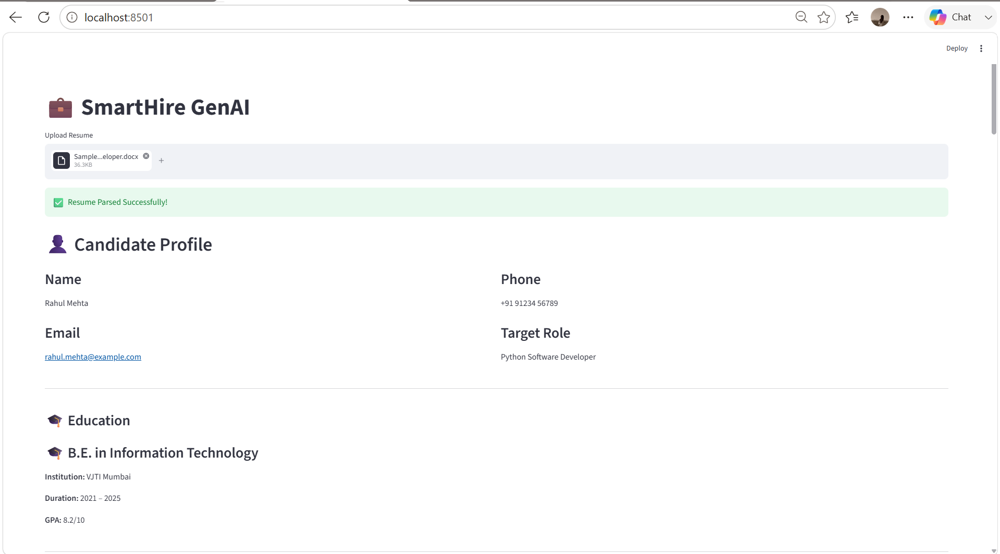
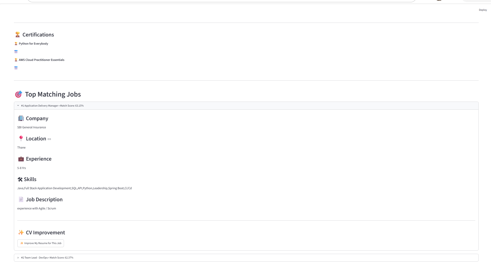
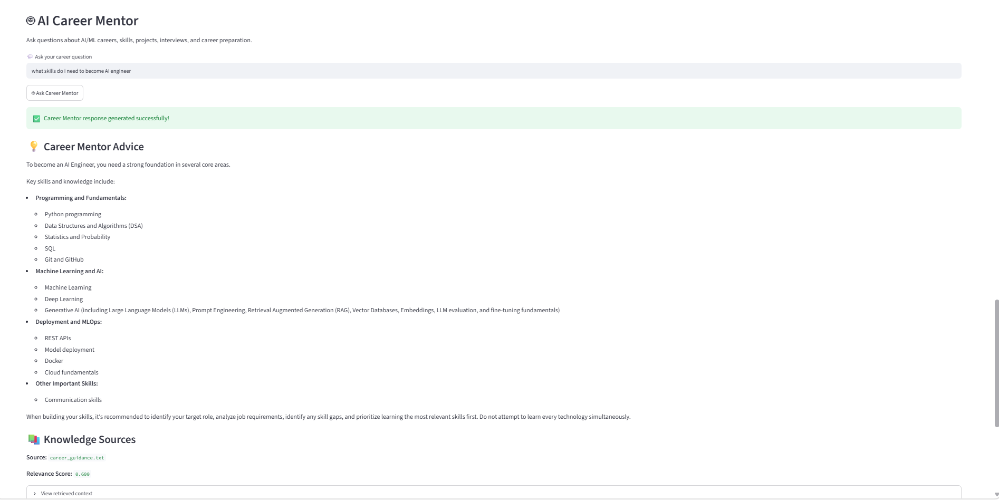
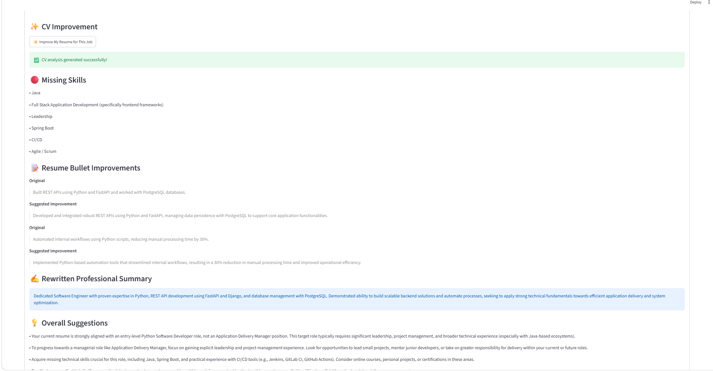
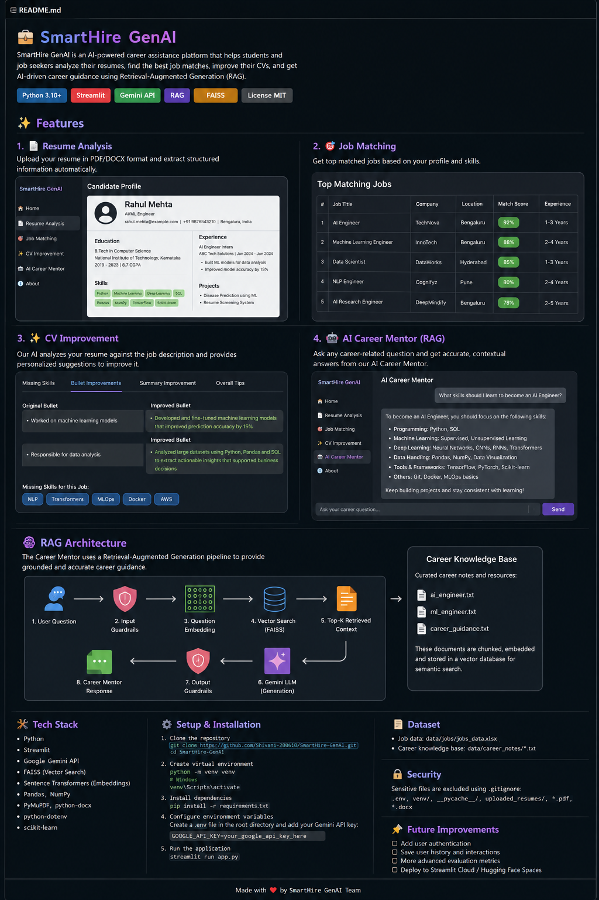

# 🚀 SmartHire GenAI

SmartHire GenAI is an AI-powered career intelligence platform that helps
job seekers analyze their resumes, identify suitable job opportunities,
receive personalized career guidance, and improve their resumes using
Generative AI and Retrieval-Augmented Generation (RAG).

The system combines resume parsing, semantic job matching, career
knowledge retrieval, AI-generated recommendations, and resume improvement
into a single application.

---

## ✨ Key Features

### 📄 Resume Parsing

Upload a PDF or DOCX resume and automatically extract important candidate
information such as:

- Name
- Email
- Phone number
- Target role
- Education
- Work experience
- Skills
- Projects
- Certifications

The extracted information is presented as a structured candidate profile.



---

### 🎯 AI-Powered Job Matching

SmartHire compares the candidate's profile with available job
opportunities and identifies the most relevant roles.

The system considers information such as:

- Job role
- Required skills
- Experience
- Location
- Job description

Jobs are ranked according to their similarity to the candidate profile.



---

### 🤖 AI Career Mentor

The Career Mentor allows users to ask questions related to:

- AI/ML careers
- Required skills
- Career preparation
- Projects
- Interviews
- Learning paths

The mentor uses a Retrieval-Augmented Generation (RAG) pipeline to
retrieve relevant information from the career knowledge base before
generating a response.



---

### ✨ CV Improvement

SmartHire analyzes the candidate's resume against a selected job and
provides personalized improvement suggestions.

It can identify:

- Missing skills
- Resume bullet improvements
- Professional summary improvements
- Overall resume improvement suggestions



---

## 🧠 RAG Architecture

The Career Mentor uses a Retrieval-Augmented Generation pipeline.

The career knowledge base contains domain-specific career information
stored as text documents. These documents are divided into overlapping
chunks and converted into vector embeddings using a Sentence Transformer
model.

FAISS is then used for similarity-based retrieval. The retrieved
knowledge is passed to the Gemini model to generate a grounded career
response.



### RAG Workflow

```text
Career Knowledge Files
        │
        ▼
Text Chunking
        │
        ▼
Sentence Transformer
Embeddings
        │
        ▼
FAISS Vector Index
        │
        │
User Career Question
        │
        ▼
Question Embedding
        │
        ▼
Similarity Search
        │
        ▼
Relevant Career Context
        │
        ▼
Gemini


        │
        ▼
Career Mentor Response
